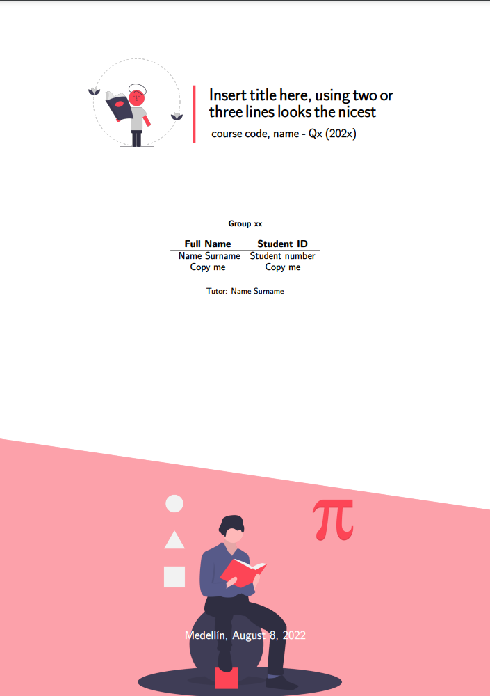
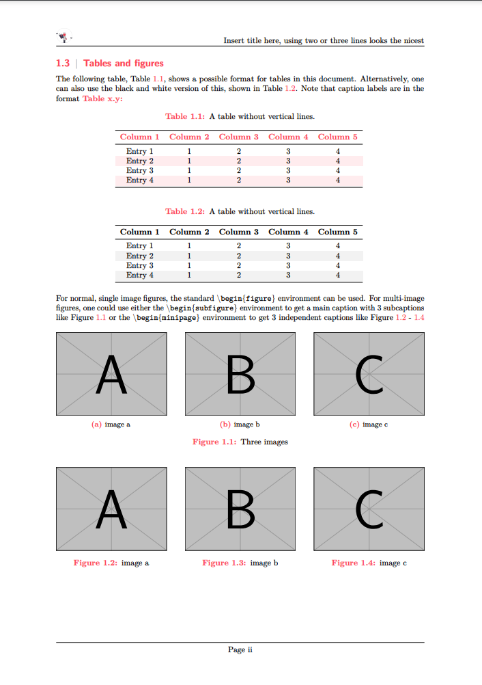
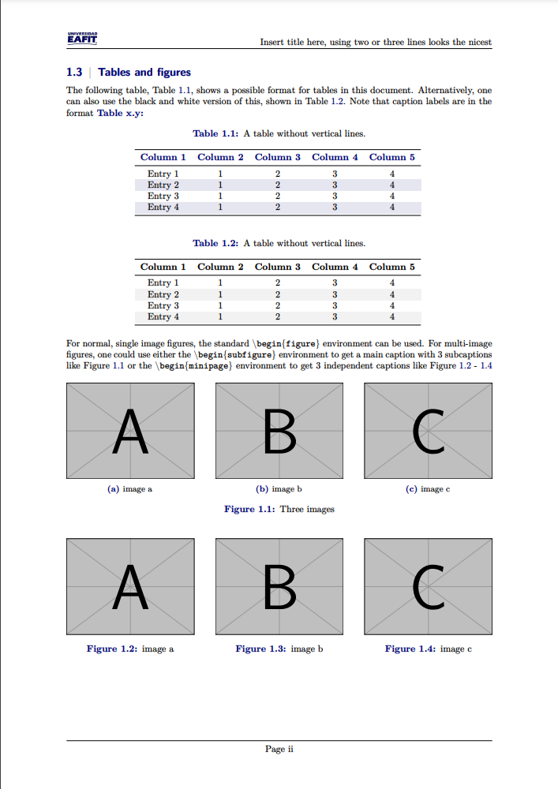

# LaTeX Note Taking Template

This is a template to take notes for University Lectures, courses or whatever
notes you want to take.

## Dependencies

Make sure to install `texlive-full` and `texlive-latex-extra`.

```shell
# Ubuntu and some Debian based distros.
sudo apt install texlive-latex-extra texlive-full -y
# Arch and some Arch based distros.
sudo pacman -S texlive-fontsextra texlive-core texlive-latexextra texlive-pictures texlive-science
```


## Build

To build manually, just use `pdflatex`:
```shell
# Run this command inside the folder of whatever version you want.
pdflatex main.tex
```

## How it looks

### General Version.

<p>
    
    
</p>

### EAFIT Version.

<p>
    
    
</p>

## Acknowledgement

I used this [LaTeX template](https://www.overleaf.com/latex/templates/report-template-v1-dot-0/xvtpxwgvmwyr) from **Kerr Beeldens** as a base for this one.